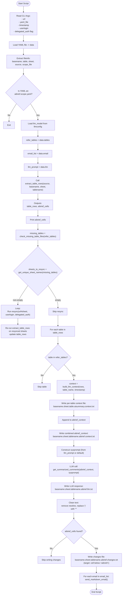

```mermaid

flowchart TD

%% =======================
%% STARTUP & INPUT
%% =======================
A0(["Start Script"]) --> A1["Read CLI Args:<br>- url<br>- yaml_file<br>- timestamp<br>- userlogin<br>- delegated_auth flag"]

A1 --> A2["Load YAML file -> data"]
A2 --> A3["Extract fileinfo:<br>basename, table, sheet, source, scope_file"]

A3 --> A4{"Is YAML an aibrief.scope.yaml?"}
A4 -->|No| A4X["Exit"]
A4 -->|Yes| A5["Load llm_model from llmconfig"]

%% =======================
%% YAML CONTENT
%% =======================
A5 --> A6["refer_tables = data.tables"]
A6 --> A7["email_list = data.email"]
A7 --> A8["llm_prompt = data.llm"]

%% =======================
%% TABLE EXTRACTION
%% =======================
A8 --> B1["Call extract_table_rows(source, basename, sheet, tablename)"]

B1 --> B2["Outputs:<br>table_rows, aibrief_cells"]

B2 --> B3["Print aibrief_cells"]

%% =======================
%% CHECK REFERENCED TABLE FILES
%% =======================
B3 --> C1["missing_tables = check_missing_table_files(refer_tables)"]
C1 --> C2{"sheets_to_resync = get_unique_sheet_names(missing_tables)"}

C2 -->|empty| C5["Skip resync"]
C2 -->|non-empty| C3["Loop:<br>Run resync(url#sheet, userlogin, delegated_auth)"]

C3 --> C4["Re-run extract_table_rows on resynced sheets<br>update table_rows"]

%% =======================
%% BUILD CONTEXT FOR LLM
%% =======================
C5 --> D1["For each table in table_rows"]
D1 --> D2{"table in refer_tables?"}

D2 -->|No| Dskip["Skip table"]
D2 -->|Yes| D3["context = build_llm_context(rows, table_name, timestamp)"]

D3 --> D4["Write per-table context file:<br>basename.sheet.table.aisummary.context.txt"]
D4 --> D5["Append to aibrief_context"]

%% =======================
%% FINAL CONTEXT OUTPUT
%% =======================
D5 --> E1["Write combined aibrief_context:<br>basename.sheet.tablename.aibrief.context.txt"]

%% =======================
%% CALL LLM
%% =======================
E1 --> E2["Construct sysprompt (from llm_prompt or default)"]
E2 --> E3["LLM call:<br>get_summarized_comments(aibrief_context, sysprompt)"]
E3 --> E4["Write LLM response:<br>basename.sheet.tablename.aibrief.llm.txt"]

%% =======================
%% CLEAN RESPONSE & WRITE CHANGES
%% =======================
E4 --> F1["Clean text:<br>remove newline, replace '|' with '^'"]

F1 --> F2{"aibrief_cells found?"}
F2 -->|No| F2X["Skip writing changes"]
F2 -->|Yes| F3["Write changes file:<br>basename.sheet.tablename.aibrief.changes.txt<br>(target: cell below &lt;aibrief&gt;)"]

%% =======================
%% EMAIL NOTIFICATION
%% =======================
F3 --> G1["For each email in email_list:<br>send_markdown_email()"]

G1 --> H(["End Script"])

```
