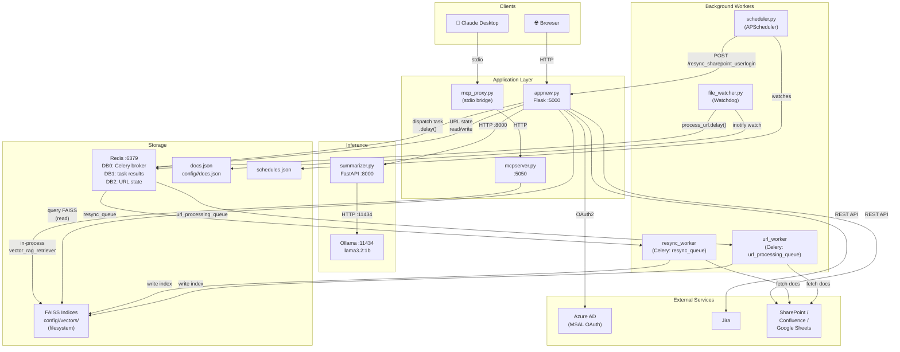

# ExcelRead — Detailed Architecture Diagram

```mermaid
flowchart TB
    subgraph Clients
        Browser["🌐 Browser"]
        ClaudeDesktop["🤖 Claude Desktop"]
    end

    subgraph External["External Services"]
        AzureAD["Azure AD\n(MSAL OAuth)"]
        Jira["Jira"]
        SP["SharePoint /\nConfluence /\nGoogle Sheets"]
    end

    subgraph AppLayer["Application Layer"]
        Flask["appnew.py\nFlask :5000"]
        MCPProxy["mcp_proxy.py\n(stdio bridge)"]
        MCPServer["mcpserver.py\n:5050"]
    end

    subgraph Workers["Background Workers"]
        FileWatcher["file_watcher.py\n(Watchdog)"]
        ResyncWorker["resync_worker\n(Celery: resync_queue)"]
        URLWorker["url_worker\n(Celery: url_processing_queue)"]
        Scheduler["scheduler.py\n(APScheduler)"]
    end

    subgraph Inference["Inference"]
        Summarizer["summarizer.py\nFastAPI :8000"]
        Ollama["Ollama :11434\nllama3.2:1b"]
    end

    subgraph Storage["Storage"]
        Redis["Redis :6379\nDB0: Celery broker\nDB1: task results\nDB2: URL state"]
        FAISS["FAISS Indices\nconfig/<user>/vectors/\n(filesystem)"]
        DocsJSON["docs.json\nconfig/<user>/docs.json"]
        SchedulesJSON["schedules.json"]
    end

    %% User flows
    Browser -- "HTTP" --> Flask
    Flask -- "OAuth2" --> AzureAD

    %% MCP flow
    ClaudeDesktop -- "stdio" --> MCPProxy
    MCPProxy -- "HTTP" --> MCPServer
    MCPServer -- "in-process\nvector_rag_retriever" --> FAISS

    %% App → services
    Flask -- "HTTP :8000" --> Summarizer
    Flask -- "dispatch task\n.delay()" --> Redis
    Flask -- "URL state\nread/write" --> Redis
    Flask -- "query FAISS\n(read)" --> FAISS
    Flask -- "REST API" --> Jira
    Flask -- "REST API" --> SP

    %% File watcher
    FileWatcher -- "inotify watch" --> DocsJSON
    FileWatcher -- "process_url.delay()" --> Redis

    %% Celery workers
    Redis -- "resync_queue" --> ResyncWorker
    Redis -- "url_processing_queue" --> URLWorker
    ResyncWorker -- "write index" --> FAISS
    URLWorker -- "write index" --> FAISS
    ResyncWorker -- "fetch docs" --> SP
    URLWorker -- "fetch docs" --> SP

    %% Scheduler
    Scheduler -- "watches" --> SchedulesJSON
    Scheduler -- "POST /resync_sharepoint_userlogin" --> Flask

    %% Summarizer → Ollama
    Summarizer -- "HTTP :11434" --> Ollama
```
