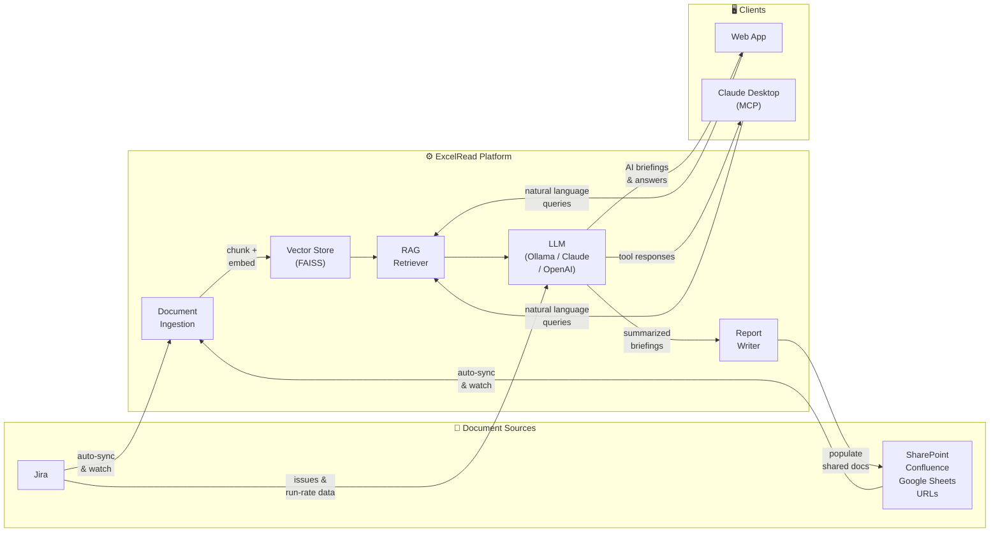

# ExcelRead — Simplified Architecture (LinkedIn)

> Built a RAG platform that auto-syncs documents from SharePoint, Jira, Confluence & more — chunks, embeds, and indexes them into FAISS, then lets you query everything in natural language via a web app or directly from Claude Desktop via MCP.
