# Resync Data Flow

## Overview

High-level pipeline: each numbered phase is detailed in its own diagram below.

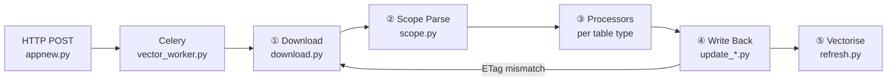

---

## ① Trigger & Download

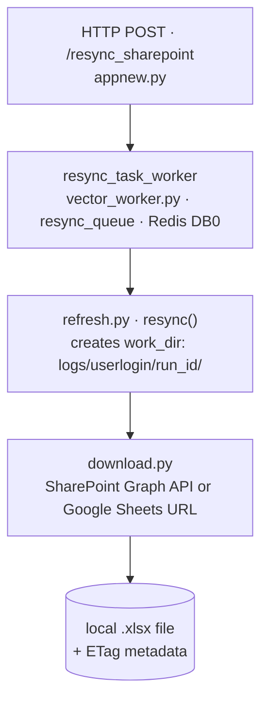

---

## ② Scope Parsing

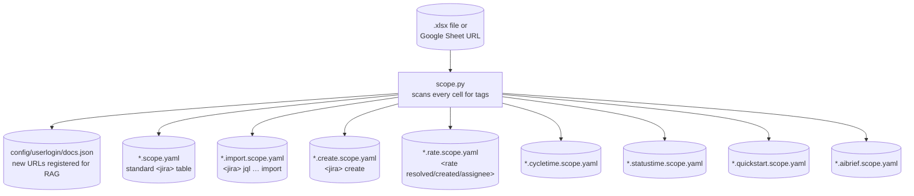

---

## ③a Standard Jira Tables

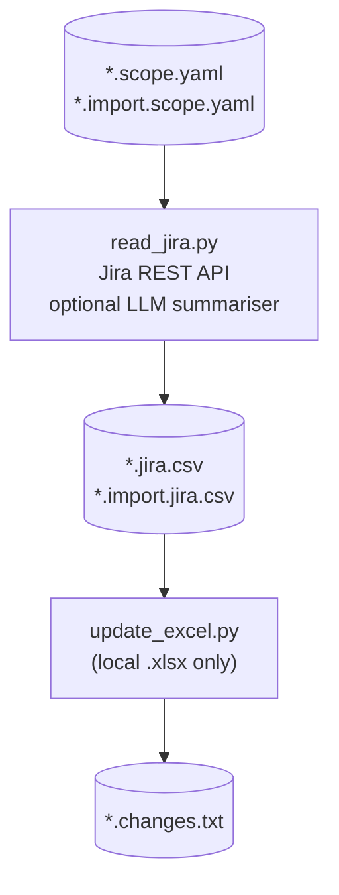

---

## ③b Create Jira Issues

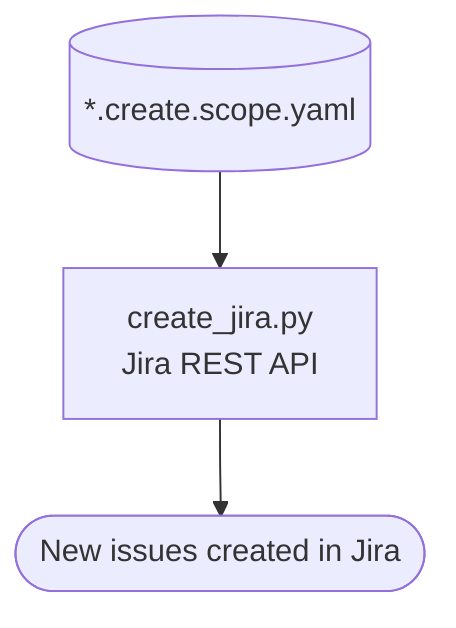

---

## ③c Runrate Processors

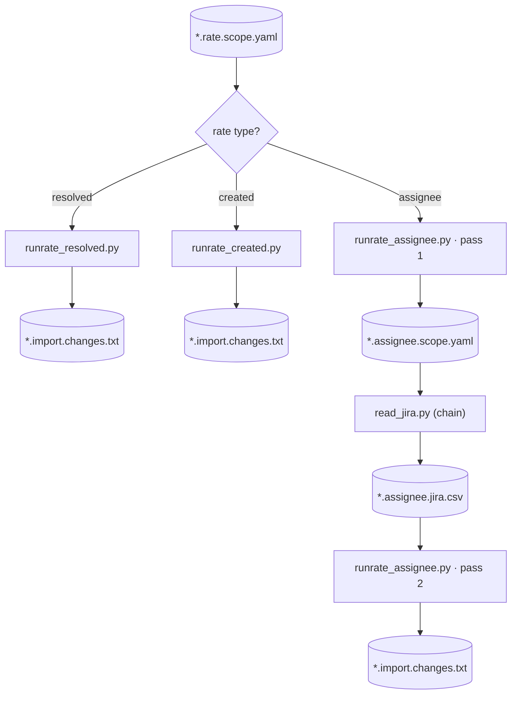

---

## ③d Cycletime (two-pass)

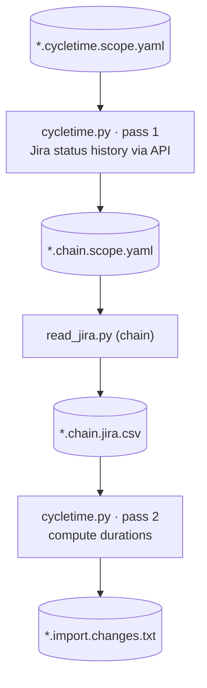

---

## ③e Statustime & Quickstart

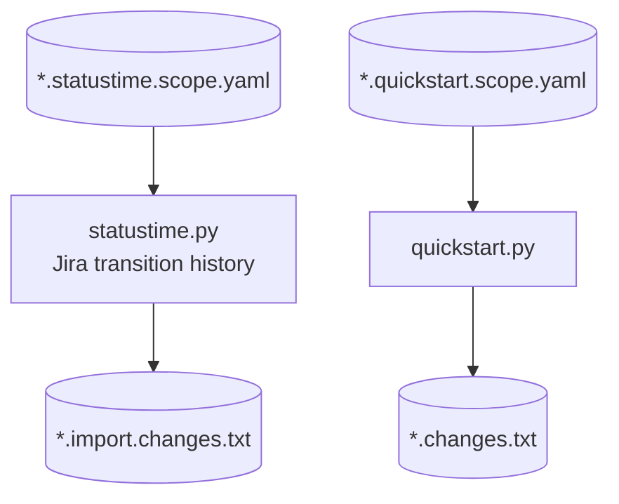

---

## ③f AI Briefing

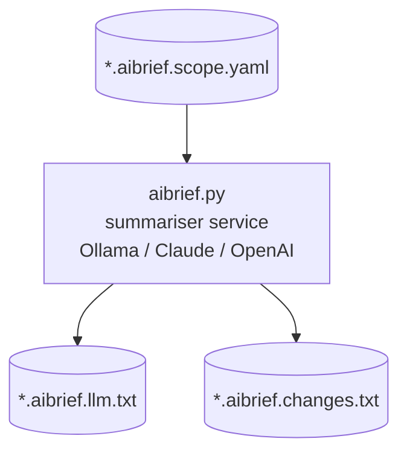

---

## ④ Write Back to Spreadsheet

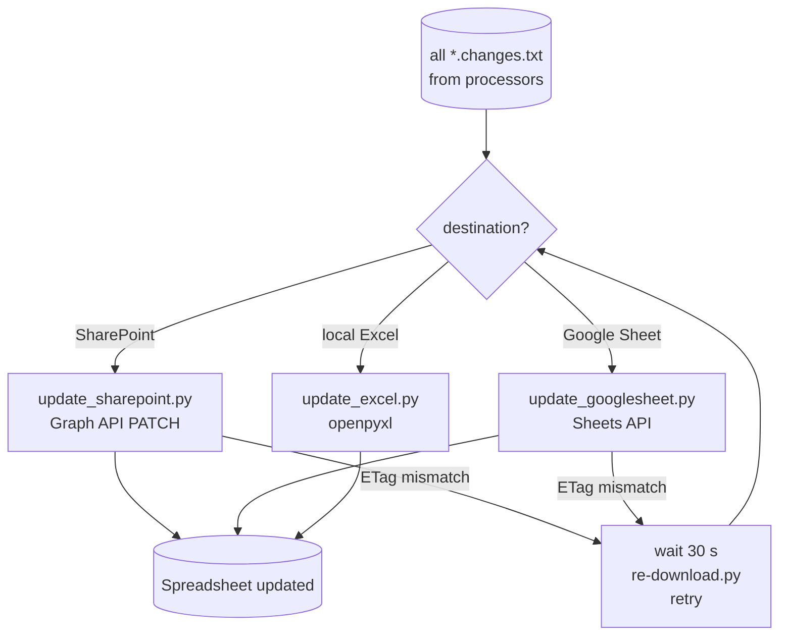

---

## ⑤ Vectorisation

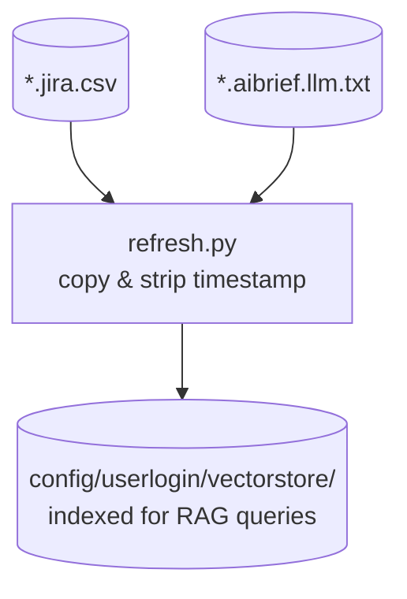

---

## Phase Summary

| Phase | Script(s) | Input | Output |
|---|---|---|---|
| ① Download | `download.py` | SharePoint / Google Sheets URL | `.xlsx` + ETag |
| ② Scope | `scope.py` | `.xlsx` / Google Sheet | `*.scope.yaml` per table tag |
| ③a Jira fetch | `read_jira.py`, `update_excel.py` | `*.scope.yaml` | `*.jira.csv` → `*.changes.txt` |
| ③b Create | `create_jira.py` | `*.create.scope.yaml` | New Jira issues |
| ③c Runrate | `runrate_*.py` + `read_jira.py` | `*.rate.scope.yaml` | `*.changes.txt` (two-pass for assignee) |
| ③d Cycletime | `cycletime.py` ×2 + `read_jira.py` | `*.cycletime.scope.yaml` | `*.changes.txt` (two-pass via chain yaml) |
| ③e Statustime / Quickstart | `statustime.py`, `quickstart.py` | `*.statustime/quickstart.scope.yaml` | `*.changes.txt` |
| ③f AI Brief | `aibrief.py` + summariser | `*.aibrief.scope.yaml` | `*.aibrief.llm.txt` + `*.changes.txt` |
| ④ Write back | `update_sharepoint/googlesheet/excel.py` | `*.changes.txt` | Spreadsheet cells updated |
| ⑤ Vectorise | `refresh.py` (inline) | `*.jira.csv`, `*.aibrief.llm.txt` | `config/userlogin/vectorstore/` |
