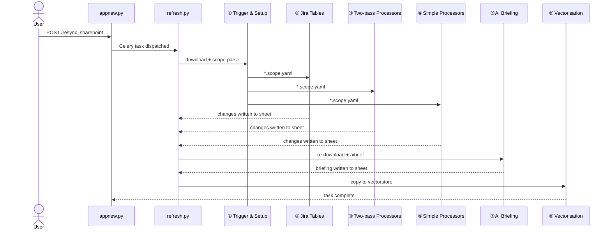
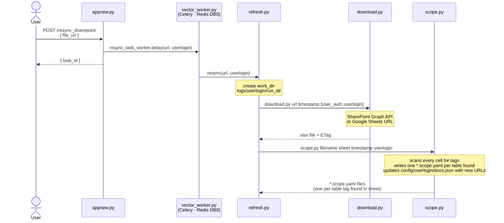
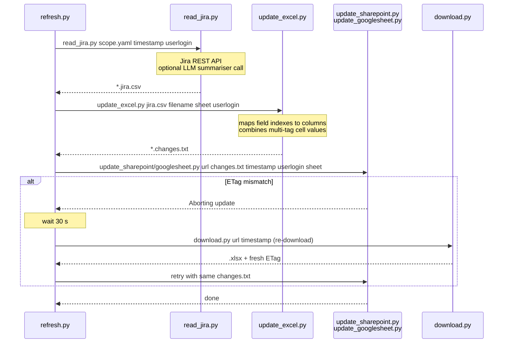
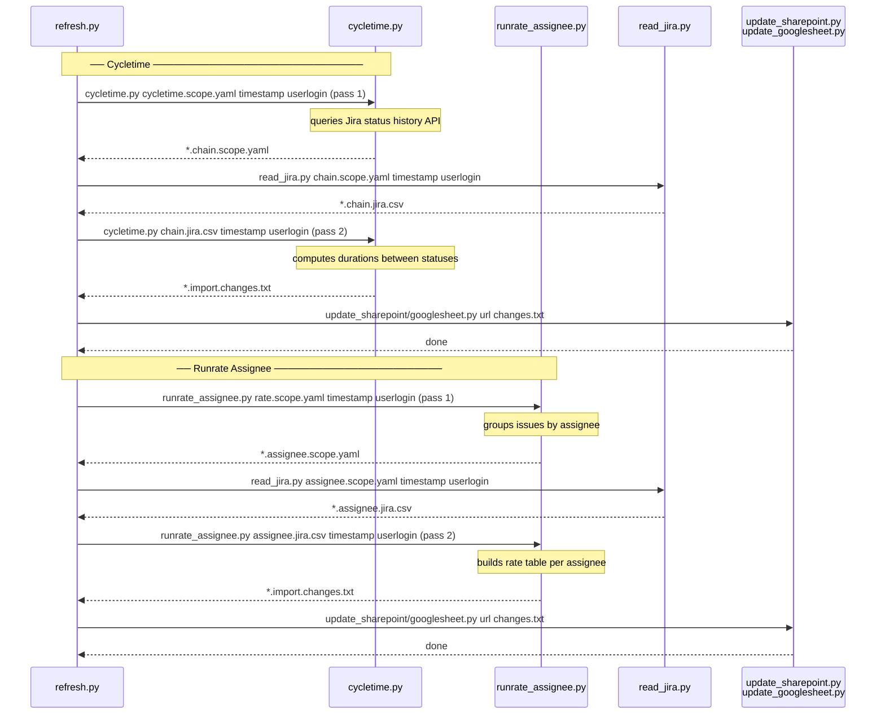
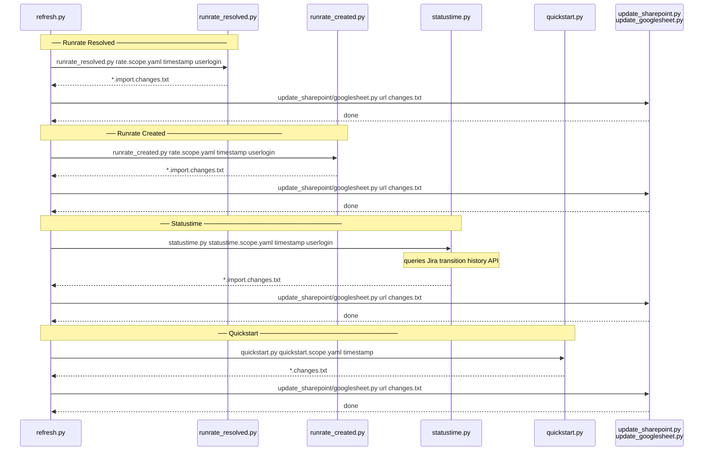
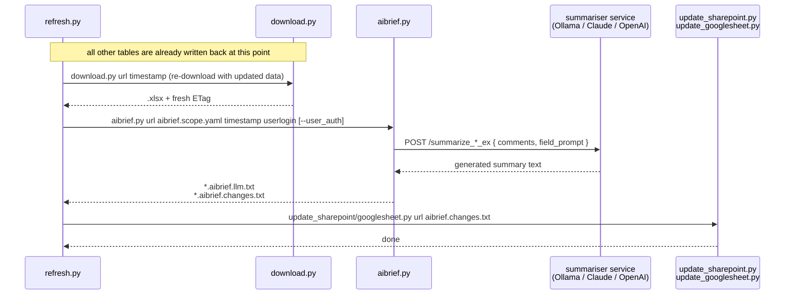
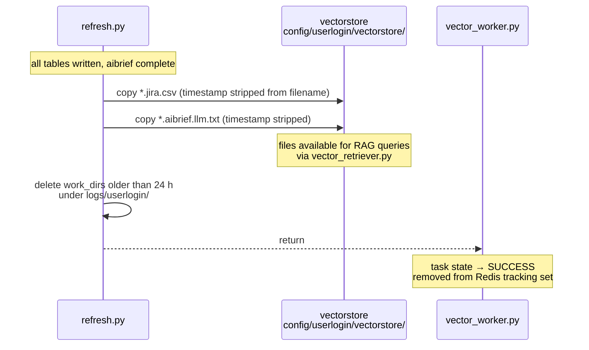

# Resync Sequence Diagrams

Each diagram covers one phase of the resync pipeline. Start with the overview to orient yourself, then drill into whichever phase you need.

---

## Overview

---

## ① Trigger & Setup

Entry point for every resync. Ends when `scope.py` has written all `*.scope.yaml` files — one per table tag found in the sheet.

---

## ② Standard Jira Tables

Runs once per `*.scope.yaml` or `*.import.scope.yaml`. The ETag retry loop handles the case where SharePoint rejects a write because the file was modified externally between download and update.

---

## ③ Two-pass Processors

Both cycletime and runrate assignee follow the same chain pattern: pass 1 produces an intermediate scope YAML, `read_jira.py` fetches the data for it, then pass 2 builds the final output.

---

## ④ Simple Processors

Single-pass processors — no chaining. Each reads its scope YAML, calls the Jira API, and writes a changes file directly.

---

## ⑤ AI Briefing

Runs **after** all other tables have been written back. A re-download is required first so `aibrief.py` reads a spreadsheet that already contains the freshly updated Jira data.

---

## ⑥ Vectorisation

Final step. Copies output files into the per-user vectorstore for RAG queries, then purges work directories older than 24 hours.

